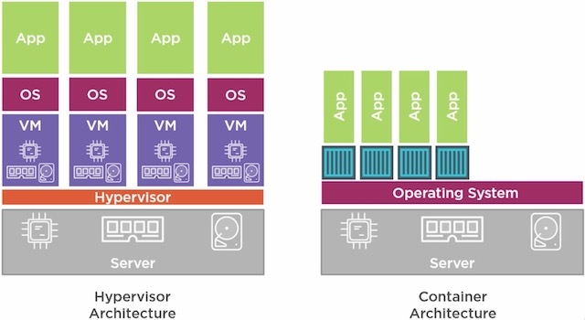

## Docker

#### Fundamentals

[CNCF Cloud Native Interactive Landscape](https://landscape.cncf.io/format=landscape)



Docker creates a virtual machine and installs a Linux system on it behind the scene, so all the future containers will be run on this settings.

Once you have docker installed on your machine, run `docker version / docker info` to check the docker info. Then run `docker run hello-world` to see if docker works properly. Docker client would tell docker server to spin up a new container (an instance of hello-world image), the latter would first check the image cache in your local machine to see if you already have the above-mentioned image. The docker server would reach out the docker hub to grab the image if you don't have one ready to serve.

#### Container

`docker container COMMAND --help` gets all the options for a particular command

`docker container run --publish 8080:80 nginx:latest` to spin up a container off the 'nginx' image

Here is what really happens behind the sciene:

1. Looks for the 'nginx' image locally in image cache first
2. Then looks in remote image repository, downloads the latest version of 'nginx:latest' from Docker Hub
3. Create a new container from that image and prepares to start
4. Gives the container a virtual IP on a private network inside docker engine
5. Opens up port 8080 on the host and forwards to port 80 in the container
6. Starts the container by using commands specified in the image `Dockerfile`

`docker container run` always starts a new container, `--detach | -d` runs the container in the background, `--name CONTAINER_NAME` assigns a name to the container

`docker container start` to start an existing stopped container

`docker container ls` lists all the running containers, `-a` flag to list all created containers

`docker container stop CONTAINER_NAME` stops a runningn container

`docker container logs CONTAINER_NAME` shows logs for a container, `-f` flag to follow log output

`docker container rm CONTAINER_NAME` removes a container, add `-f` flag to remove a running container

`docker top CONTAINER_NAME` lists running processes in a specific container

#### Image

`docker search image_name` search docker image on docker hub

`docker pull image_name` pull the docker image from docker hub

`docker images` list all the docker images on your machine

`docker create image_name` create an instance of the image

`docker start container_id` run the startup command of the instance

`docker run -d image_name` is equal to `docker create` + `docker start`. Use `-d` flag to run containers in the background

`docker ps` list all running containers 

`docker ps --all` list all created containers

`docker stop container_id` tell a running container to shut itself down

`docker kill container_id` kill a running container right away

`docker system prune` remove all stopped containers, dangling images and build cache

`docker logs container_id` show all the logs emitted by a container

`docker exec -it container_id sh` get into the shell of the container

`docker exec -it container_id command` to run a command inside a container

For example, you can run `redis-cli` in a Redis container by `docker exec -it 093b6e72ff2b redis-cli`

The `-i` flag allows us to provide input from terminal to standard input of the running process in the container

#### Create a docker image

1. Create a Dockerfile

Create a file called `Dockerfile` in your docker image folder, no file extension is needed.

```
# use an existing docker image as a base
FROM alpine

# download and install dependencies
RUN apk add --update redis

# set up startup commands
CMD ["redis-server"]
```

2. Build and tag the image by running `docker build -t docker_id/project_name:latest .` in the docker image folder.

#### Build a simple Node.js app

Create a `Dockerfile` as follows:

```
# use an existing docker image as a base
FROM node:alpine

# set the working directory, any following command will be executed relative this path
WORKDIR /usr/app

# copy the package.json from local machine to the container
# so that even you change your code NPM will not re-install all your packages
# first argument is path relative to build context
# second argument is path inside the container
COPY ./package.json ./
# download and install dependencies
RUN npm install

# copy everything from local machine to the container
COPY ./ ./

# set up startup commands
CMD ["npm", "start"]
```

Run `docker build -t dennisxiao/simpleweb .` to build the docker image.

When the docker image is successfully built, run `docker run -p 5000:8080 image_name`.

The `-p 8080:8080` flag maps the incoming requests to localhost to the port inside the container.

#### Build a visitor counter app

Architecture: One Redis docker is used to store the visitor count, while you can scale up the Node.js docker to handle more traffic.

```
Node.js Docker ---> |------------|
Node.js Docker ---> |Redis Docker|
Node.js Docker ---> |____________|
```

1. Create a `Dockerfile` with the same setting as the simple Node.js app

2. Run `docker build -t dennisxiao/visit .` to build the docker image

3. In order for the Node.js container to communicate with the Redis docker, we need to use `docker-compose`. Create a `docker-compose.yml` file with the following content.

```
version: '3'

services: 
  redis-server:
    image: 'redis'
  node-app:
    restart: always
    build: .
    ports:
      - "8080:8080"
```

Then you can use `docker-compose up` to launch all containers, or `docker-compose up --build` to build the image and launch all containers.

#### Docker compose

`docker-compose up -d` run all the containers in the background

`docker-compose down` shut down all the containers

`docker-compose ps` list all the running containers
